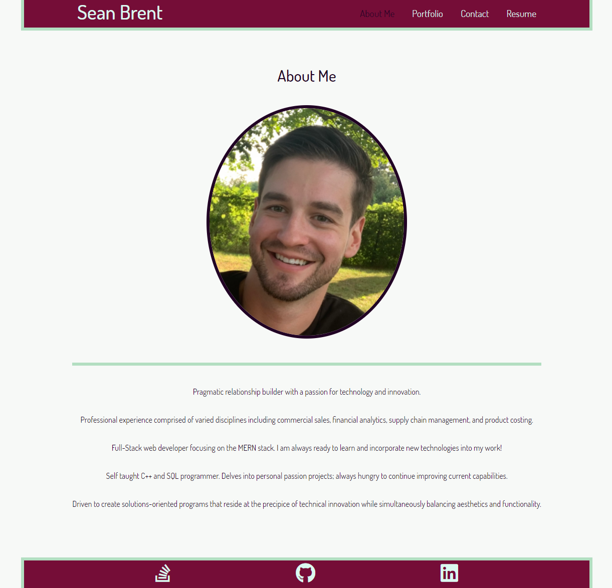

# Sean Brent Portfolio

## Description
Welcome to my personal programming portfolio (Some aliteration for you!). It is a single page application that was developed using React. Users can learn a little bit about me, view my portfolio of projects, check out my competencies, and download my resume. Feel free to connect with me to chat about anything related to software development! :) 

## Table of Contents

* [Usage](#Usage)
* [License](#License)
* [Questions](#Questions)
* [Credits](#Credits)

## Usage
Click this [link](https://brentsa.github.io/react-portfolio/) to view my portfolio!
  

## License
MIT License

## Questions
You may contact the project author via:
* Email: seanbrent5@gmail.com
* GitHub: [Brentsa](https://github.com/Brentsa)

## Credits
Sean Brent - Full-Stack Developer