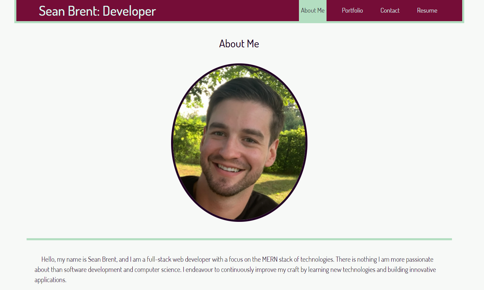

# Sean Brent Portfolio

## Description
This is my personal coding portfolio. It was developed using React and is a single page application.

## Table of Contents

* [Usage](#Usage)
* [License](#License)
* [Questions](#Questions)
* [Credits](#Credits)

## Usage
Follow the [link](https://brentsa.github.io/react-portfolio/) here to my portfolio!
  

## License
MIT License

## Questions
You may contact the project author via:
* Email: seanbrent5@live.ca
* GitHub: [Brentsa](https://github.com/Brentsa)

## Credits
Sean Brent